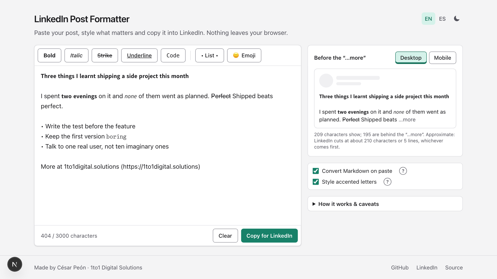

# LinkedIn Post Formatter

Bold, italic, strikethrough, underline and code for LinkedIn posts, from Markdown or by hand.
Paste your draft, style the words that matter and copy the result straight into LinkedIn.

**Live:** https://linkedin-post-format.vercel.app



Everything runs in the browser. There is no server, no database and no analytics: the text never
leaves the page, and the draft is kept in `localStorage` so a reload does not lose it.

## What it does

- **Converts Markdown on paste**: `**bold**`, `*italic*`, `~~strike~~`, `` `code` ``, headings
  (`# …`, as bold), bullets (`- …` → `•`) and links (`[text](url)` → `text (url)`). Everything
  else stays as written. No button to press: paste and it is done.
- **Formats by hand**: double-click a word (or select some text, or just leave the caret on a
  word) and press a button or a shortcut: `Ctrl/⌘ + B`, `I`, `U` and `Shift + X`. Pressing it
  again removes the style. `Ctrl/⌘ + Z` undoes, because changes are typed into the field instead
  of replacing it.
- **Styles accented letters** (á, ñ, ü…) as the styled letter plus a combining accent, so a word
  does not end up half bold. It can be turned off if a device renders the accent out of place.
- **Never touches links, emails, #hashtags or @mentions**, so LinkedIn keeps recognizing them.
- **Lists and emojis**: a List menu with bullets, dashes, arrows, check marks, pointing hands,
  diamonds, numbers and number emojis on the selected lines (Enter continues the list), and a
  full emoji picker with search and skin tones.
- **Counts characters** the way LinkedIn does (every styled letter counts two toward the 3,000
  limit) and **previews the "…more" cut** on desktop and mobile.
- **English or Spanish interface** and **light or dark theme**, following the browser until you
  pick one. Both choices are remembered.

## How it works

LinkedIn only stores plain text. What looks bold is a different set of letters, the ones from the
Unicode *Mathematical Alphanumeric Symbols* block (U+1D400–U+1D7FF); strikethrough and underline
are a combining mark after each character. The details, the caveats (screen readers, search) and
the decisions behind the tool are in [docs/how-it-works.md](docs/how-it-works.md).

## Development

```sh
nvm use        # Node 24
pnpm install
pnpm dev       # http://127.0.0.1:3400
```

| Command | What it does |
|---|---|
| `pnpm dev` / `build` / `start` | Next.js on port 3400 |
| `pnpm typecheck` / `lint` | TypeScript and ESLint |
| `pnpm test` / `coverage` | Vitest; `lib/` is required to stay at 100 % coverage |

The logic lives in `lib/format/` and is pure and fully tested: `glyphs.ts` reads and writes styled
letters, `apply.ts` toggles styles on a selection, `markdown.ts` converts Markdown, `protected.ts`
finds what must stay plain, `lists.ts` handles bulleted and numbered lines, `hook.ts` computes the
"…more" cut. `app/` is the thin wrapper that connects it to the `<textarea>`, the clipboard and
`localStorage`; the interface texts live in `app/_ui/i18n/`.

Built with Next.js 16, React 19, TypeScript, Tailwind CSS 4 and Vitest, plus
[emoji-picker-element](https://github.com/nolanlawson/emoji-picker-element) for the emoji picker
(its data is served from this same origin by `app/emoji-data/`). Deployed on Vercel.

## License

[MIT](LICENSE)
